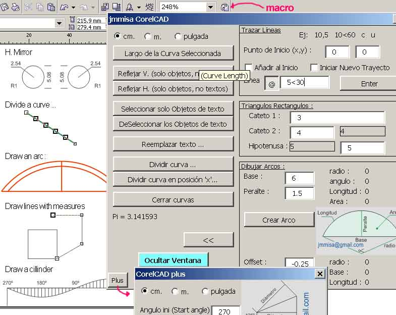

<div align="center">

## CAD for Corel Draw \- Full3


</div>

### Description

CAD tools for all versions of Corel Draw: Curve length, Special mirror, Special text selection, Replace multiple text objects, divide and close a curve, draw lines using measures, Arcs and Cylinder developments. ---(English and Spanish versions in the zip!!!) ---(Read the Readme.txt file for the installation guide)

---Herramientas CAD para Corel Draw: largo de una curva, reflejos especiales, selecciones especiales de texto, reemplazar el contenido de multiples objetos de texto, dividir y cerrar curvas, dibujar l&#237;neas usando medidas, Arcos y Desarrollo de cilindros. Pd. Leer el archivo Leame.txt !!!
 
### More Info
 
Start corel, then get into the menu ::Visual Basic:VBA Editor,

then select GlobalMacros.Forms and import "manolo.frm" and "manoloplus.frm"

then select GlobalMacros.Modules and import "cadinicio.bas"

Save and exit to Corel Draw

then get into ::Options:Work Space:Personalize:Commands:Macros

and drag the macro-button "GlobalMacros.Cadinicio.corelcad"

to a tool bar.

Cargar Corel, luego entrar al men&#250; ::Visual Basic: Editor de Visual Basic,

Seleccione GlobalMacros.Formularios e importar Manolo.frm y manoloplus.frm,

Seleccione GlobalMacros.M&#243;dulos e importe CadInicio.bas,

Grabar y salir a Corel Draw

luego entre a ::Opcione:Espacio de Trabajo:Personalizar:Comandos:Macros

y arrastre el macro-bot&#243;n "GlobalMacros.Cadinicio.corelcad"

hacia una barra de herramientas


<span>             |<span>
---                |---
**Submitted On**   |2006-08-03 01:42:40
**By**             |[Corel Tutor](https://github.com/Planet-Source-Code/PSCIndex/blob/master/ByAuthor/corel-tutor.md)
**Level**          |Intermediate
**User Rating**    |5.0 (10 globes from 2 users)
**Compatibility**  |VB 6\.0, VB Script
**Category**       |[Microsoft Office Apps/VBA](https://github.com/Planet-Source-Code/PSCIndex/blob/master/ByCategory/microsoft-office-apps-vba__1-42.md)
**World**          |[Visual Basic](https://github.com/Planet-Source-Code/PSCIndex/blob/master/ByWorld/visual-basic.md)
**Archive File**   |[CAD\_for\_Co201076832006\.zip](https://github.com/Planet-Source-Code/corel-tutor-cad-for-corel-draw-full3__1-66049/archive/master.zip)

### API Declarations

```
'For the english version
'unzip the English zip file
'included in the main zip file
'Read the readme.txt file
'comments by juan.c.c.t.
```


